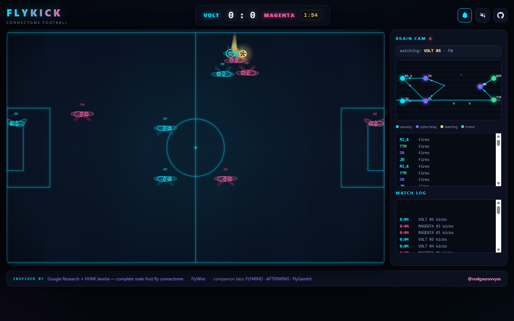
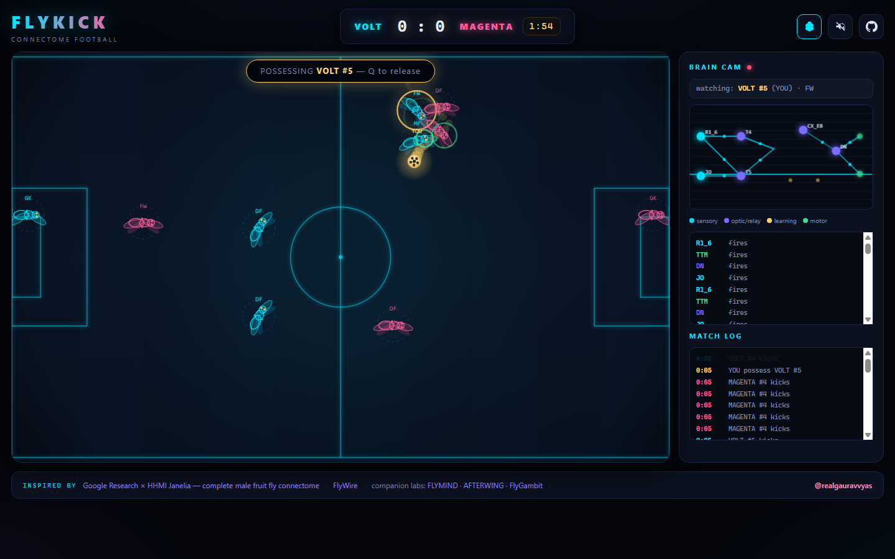
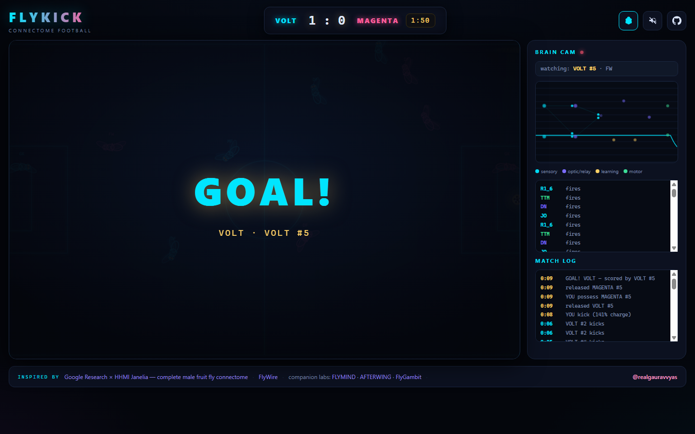
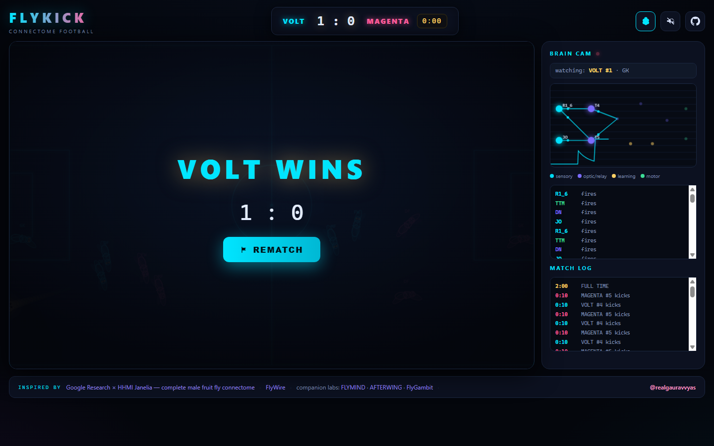

# FLYKICK 🪰⚽
### Neural-Circuit Drosophila Football — Live in Your Web Browser

<p align="center">
  <a href="https://realgauravvyas.github.io/connectomics/flykick/">
    
  </a>
  <a href="https://realgauravvyas.github.io/connectomics/">
    
  </a>
</p>

[](https://research.google/blog/a-connectomics-milestone-mapping-the-complete-male-fruit-fly-brain/)
[](https://realgauravvyas.github.io/connectomics/flykick/)
[](https://realgauravvyas.github.io/connectomics/flykick/)
[](https://realgauravvyas.github.io/connectomics/flykick/)
[](https://realgauravvyas.github.io/connectomics/flykick/)
[](https://opensource.org/licenses/MIT)

> ⚽ **Play Live in Your Browser:**  
> 👉 **[https://realgauravvyas.github.io/connectomics/flykick/](https://realgauravvyas.github.io/connectomics/flykick/)**  
> *Part of the [CONNECTOMICS Suite](https://realgauravvyas.github.io/connectomics/) by Gaurav Vyas.*

**Two teams of neural-circuit flies play football. Possess any fly on either team, any time — and take over the match yourself.**

Every athlete on the pitch is driven by an embodied miniature connectome circuit: compound photoreceptors $\to$ optic lobe motion detectors $\to$ central complex steering $\to$ wing and leg motor effectors. Watch autonomous AI flies pass and contest the ball, or seize control of any forward or goalkeeper mid-match.

---

## 📸 Interactive Visual Showcase

| **MATCH IN PLAY** — 2 teams of 5 neural flies contesting possession | **POSSESSION HIJACK** — Seize any fly's Central Complex live |
|:--:|:--:|
|  |  |
| **DYNAMIC GOAL DETECTION** — Accurate mouth scoring & post deflection | **FULL TIME & REMATCH** — Procedural crowd roar, whistles & stats |
|  |  |

---

## 🎮 How to Play & Controls

| Control | Action |
|---|---|
| **Click any fly** | **Possess it** — either team (VOLT or MAGENTA), anytime during the match |
| **WASD / Arrow Keys** | Drive your possessed fly across the pitch |
| **Space (Hold to Charge)** | Charge kick velocity — release to shoot (tap/hold near ball to trap & dribble) |
| **Q Key** | **Release possession** back to autonomous neural circuit control |

The remaining nine flies play autonomously via their biological circuits: the nearest player aggressively chases the ball, second-line players provide triangular support, defenders patrol passing lanes, and goalkeepers execute diving saves.

---

## 🧠 The Brain Inside Each Boot (Brain Cam Telemetry)

The **Brain Cam** panel streams the live electrophysiology of whichever fly you are currently observing or possessing:

```
  [ SENSORY PERCEPTION ]
    • R1–R6 Photoreceptors  ──►  Fires whenever the ball enters the visual receptive field
             │
             ▼
  [ MOTION & OPTIC PROCESSING ]
    • T4/T5 + HS (Optic Lobe)──►  Directional motion tracking and relative ball velocity
             │
             ▼
  [ CENTRAL INTEGRATION & STEERING ]
    • Central Complex (CX)   ──►  Commands heading and steering angle
                                 (⚡ Possessing a fly directly overrides this node!)
             │
             ▼
  [ PLASTICITY & MEMORY ]
    • Kenyon Cells (KC)      ──►  Activity-dependent memory flash during offensive transitions
             │
             ▼
  [ MOTOR OUTPUT EFFECTORS ]
    • Wing Motor Neurons     ──►  Spikes during sprint bursts and acceleration
    • TTM Leg Motor Neurons  ──►  Fires motor spikes on ball contact and power kicks
```

---

## ⚔️ Match Specifications & Engine Rules

- **Format:** 2 teams $\times$ 5 flies (1 Goalkeeper, 2 Defenders, 1 Midfielder, 1 Forward).
- **Duration:** 2-minute regulation countdown with stoppage/goal resets.
- **Physical Dynamics:** Clean elastic ball collisions, boundary wall reflections, accurate goalmouth detection (shots outside the posts rebound cleanly off the end boards).
- **Procedural Sound Engine:** 100% Web Audio API synthesis (zero audio files): dynamic crowd roar that swells with proximity to goal, ball-thumping percussions, referee whistles, and victory arpeggios.

---

## 🧪 Automated Testing & Verification

Run the headless match verification suite:

```bash
node tools/test-engine.js
```

**Benchmark Results:**
```
  ✅ 10 flies on the pitch (2×5)
  ✅ starts in kickoff
  ✅ ball at centre
  ✅ AI plays — ball gets kicked (peak speed 9.6)
  ✅ clock runs within goal-reset window (20.0s, 0 goal(s) meanwhile)
  ✅ match ends at full time (120s, score 0:1)
  ✅ possessed fly moves UP on command (dy=-114.0)
  ✅ possessed fly responds DOWN too
  ✅ kick charges while holding space (62%)
  ✅ charged kick sends ball flying (vx=6.8)
  ✅ Q releases possession
  ✅ ball crossing LEFT goal mouth scores for MAGENTA (0:1)
  ✅ ball crossing RIGHT goal mouth scores for VOLT (1:1)
  ✅ wide shot (outside the posts) is NOT a goal (0:0)
  ✅ wide shot bounces off the boards instead (vx=5.4)
RESULT: 16 passed, 0 failed
```

---

## 📁 Repository Structure

```
flykick/
├── index.html              # Broadcast-neon stadium shell + Brain Cam HUD
├── css/style.css           # Pitch styling, neon glow, overlays, and scoreboard
├── js/
│   ├── brain.js            # 11-neuron anatomical circuit per fly (DOM-free)
│   ├── engine.js           # Physics, pitch bounds, possession, goal detection
│   ├── render.js           # 2D Canvas pitch rendering, flies, ball, celebration beams
│   ├── input.js            # WASD controls + click-to-possess state handler
│   ├── audio.js            # Procedural Web Audio API sound generator
│   └── main.js             # Match loop, telemetry streaming, toast banners
└── tools/
    ├── test-engine.js      # Headless Node.js test suite (16 assertion checks)
    └── play-audit.cjs      # Comprehensive browser audit runner
```

---

## 🌐 Complete Connectomics Ecosystem

FLYKICK is part of the [**CONNECTOMICS**](https://realgauravvyas.github.io/connectomics/) simulation suite:

- 🧠 **[FLYMIND](https://realgauravvyas.github.io/connectomics/flymind/):** Interactive connectome playground: poke senses, train mushroom body, explore 42 neuron classes.
- ♟️ **[FlyGambit](https://realgauravvyas.github.io/connectomics/fly-gambit/):** Sparse *Drosophila* connectome learning chess with interactive mid-game brain lesioning.
- 🏃 **[FlySprint](https://realgauravvyas.github.io/connectomics/fly-sprint/):** 1–5 evolved flies with 94-weight neural gait controllers racing 100m–400m and hurdles.
- 🔬 **[MUSCA](https://realgauravvyas.github.io/connectomics/musca/):** 166,700 reconstructed neurons with 2.82M edges and reverse behavior search.
- ⚡ **[166k](https://realgauravvyas.github.io/connectomics/166k/):** Large-scale Leaky Integrate-and-Fire (LIF) spiking electrophysiology with dopamine conditioning.
- 🌌 **[SYNAPTICA](https://realgauravvyas.github.io/connectomics/synaptica/):** 12 mapped neuropil hubs with real-time Hebbian plasticity tracking.
- 🪰 **[DROSOMIND](https://realgauravvyas.github.io/drosomind/):** Articulated 3D male fly with bio-acoustic courtship song synthesis.

---

## 📚 Scientific References

- Google Research, HHMI Janelia, FlyEM Consortium:  
  *"Sexual dimorphism in the complete connectome of the Drosophila male central nervous system"*, **Cell** (September 2026).
- Google Research Announcement:  
  [A connectomics milestone: Mapping the complete male fruit fly brain][blog].
- FlyWire Whole-Brain Consortium ([flywire.ai][flywire]).

[blog]: https://research.google/blog/a-connectomics-milestone-mapping-the-complete-male-fruit-fly-brain/
[flywire]: https://flywire.ai

---

## 👤 Author

**Gaurav Vyas**  
- 🌐 **Academic Profile:** [socialpsychology.org/member/gaurav-vyas](https://www.socialpsychology.org/member/gaurav-vyas)  
- 🔶 **Interactive Portfolio:** [realgauravvyas.github.io](https://realgauravvyas.github.io/)  
- 🐙 **GitHub:** [@realgauravvyas](https://github.com/realgauravvyas)  
- 🪰 **Full Connectomics Suite:** [realgauravvyas.github.io/connectomics](https://realgauravvyas.github.io/connectomics/)

---

## 📄 License

MIT License &copy; 2026 Gaurav Vyas. Open-source science for everyone.
